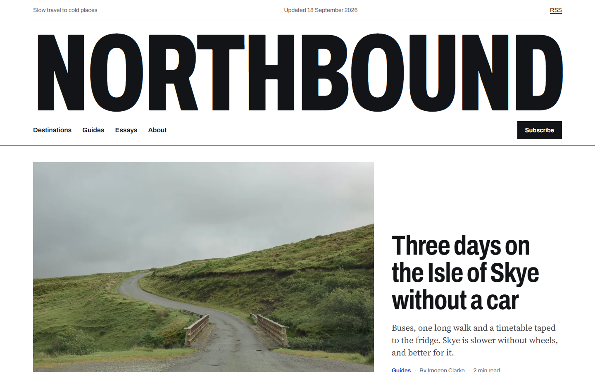

# Northbound: Magazine & Blog Template

A fast, readable magazine and blog theme for publishers, travel writers, newsletters and content businesses. Built with [Astro](https://astro.build): articles are Markdown files, images are optimised automatically, and the site ships as static HTML with RSS and a sitemap.



> **Northbound is a fictional magazine.** Articles, writers and quotes are sample content written for this template. Photographs are free images from Unsplash, credited on each article.

## Features

- **Magazine front page**: big masthead, lead story, latest stories, and an index by section.
- **Article pages** built for reading: serif body at a comfortable measure, drop cap, pull quotes, breakout photos, author box and "Keep reading".
- **Sections** (Destinations, Guides, Essays) with their own pages.
- **Newsletter sign-up** with validation (connect it to Buttondown, Mailchimp, ConvertKit...).
- **SEO ready**: RSS feed, sitemap, canonical URLs, Open Graph images generated from each article's cover.
- **Accessible**: semantic HTML, skip link, visible focus, WCAG AA contrast, reduced-motion support.
- **Fast**: static HTML, self-hosted fonts, responsive WebP images, almost no JavaScript.

## Run it locally

Requires Node.js 22.12 or later.

```bash
npm install
npm run dev
```

Open http://localhost:4321.

## Write a new article

Create `src/content/posts/my-article.md`:

```md
---
title: "My article title"
dek: "One or two sentences that sell the story."
date: 2026-10-01
category: Guides          # Destinations | Guides | Essays
author: imogen            # imogen | theo | aiko (see src/data/authors.ts)
cover: ../../assets/posts/my-photo.jpg
coverAlt: "Describe the photo for screen readers"
coverCredit: { name: "Photographer", url: "https://..." }
featured: false           # true puts it in the lead slot on the home page
---

Your article in Markdown. Use ## for subheadings, > for pull quotes,
and  for inline photos.
```

## Customise

| What | Where |
|---|---|
| Magazine name, tagline, email | `src/site.ts` |
| Writers | `src/data/authors.ts` (avatars show initials, see `src/components/Avatar.astro`) |
| Sections | `CATEGORIES` in `src/content.config.ts` and the blurbs in `src/pages/category/[category].astro` |
| Colours and fonts | CSS variables at the top of `src/styles/global.css` |
| Domain (for RSS/sitemap) | `site` in `astro.config.mjs` |

## Deploy to Cloudflare Pages

- **Dashboard:** Workers & Pages → Create → Pages → Connect to Git → pick this repo. Framework preset: **Astro**. Build command: `npm run build`. Output directory: `dist`.
- **CLI:**
  ```bash
  npm run build
  npx wrangler pages deploy dist --project-name northbound
  ```

## Credits

- Typefaces: [Archivo](https://fonts.google.com/specimen/Archivo) and [Source Serif 4](https://fonts.google.com/specimen/Source+Serif+4), SIL Open Font License.
- Photos: [Unsplash](https://unsplash.com) contributors under the [Unsplash License](https://unsplash.com/license). Cover credits are in each article's `coverCredit`; inline photos: Tim Rüßmann (Skye), Petr Slováček (Lofoten), Diane Picchiottino (Montréal), lastmayday (Hokkaido), Annie Spratt (Faroe Islands), Agent J (Bergen).
- Built by **NC Atelier**.

---

### Want a site like this for your business?

NC Atelier designs and builds fast, accessible websites for businesses in the UK, US and Canada.

**Get in touch:** [ncatelier.com](https://ncatelier.com) · [LinkedIn](https://www.linkedin.com/in/cadetnicolas)
