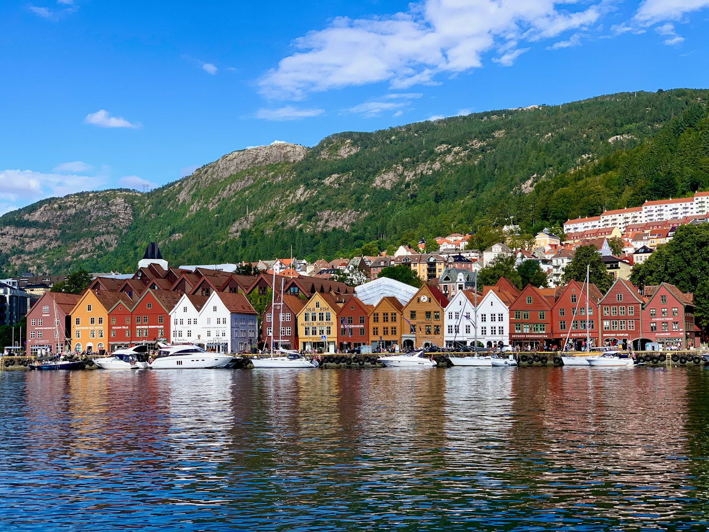

Bergen is famous for two things: its wooden waterfront and its rain. Both are real. Pack a good jacket and you'll find a compact, walkable city with mountains at the end of every street and the fjords a short boat ride away.

## Friday: the old town

Start at Bryggen, the row of wooden merchant houses on the harbour and a UNESCO World Heritage Site. Walk the narrow passages behind the facades, where the timber leans and creaks. Then cross to the fish market for lunch, and spend the afternoon in the small museums around the harbour.

## Saturday: up a mountain

Take the Fløibanen funicular up Mount Fløyen for the classic view over the city, then walk back down through the forest. If you have the legs, the ridge walk from Fløyen to Ulriken is one of the great day hikes from any European city. Check the weather first: cloud can close in quickly.

## Sunday: out on the water

Join a day cruise into the fjords, or take a local ferry to the islands west of the city. Either way, you'll be back for dinner and a last walk along the harbour as the lights come on.

## Practical notes

- Bergen is easy on foot; you won't need a car.
- Norway is expensive: supermarket picnics are your friend.
- The airport express bus goes straight to the city centre.
- It rains a lot. Locals will tell you there's no bad weather, only bad clothing.
