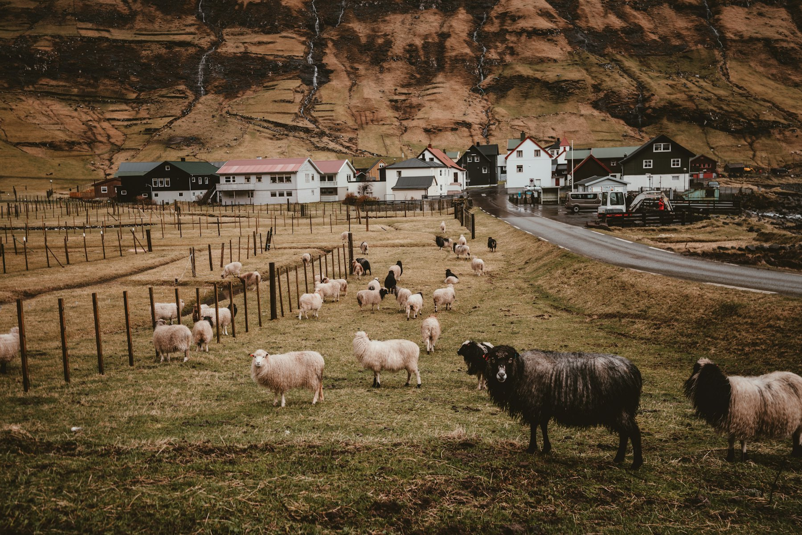

The first thing you notice in the Faroes is the sheep. The second is how many people with tripods are photographing them. In a few short years these islands went from a place most travellers couldn't find on a map to one of the most shared landscapes online.

## A working landscape

The cliffs, waterfalls and turf-roofed villages are beautiful. They are also farms, grazing land and people's homes. Several popular walks cross private land, and some landowners now ask walkers to pay a fee or join a guide. It is easy to feel annoyed by this. It is more useful to ask why it became necessary.

## How to be a better guest

- **Stay on marked paths**, and close every gate behind you.
- **Pay the hiking fee** where there is one, without complaint.
- **Ask before photographing people** or their houses up close.
- **Spend money locally**: eat in village cafés, buy wool from the people who raised the sheep.
- **Stay longer, see less.** Two days in one valley teaches you more than five viewpoints in an afternoon.

> The most beautiful places are rarely empty. They are full of people whose lives carry on after we put the camera down.

## What stays with you

I went for the cliffs. What I remember is a conversation in a village shop about the weather, which in the Faroes is a serious subject. The woman behind the counter told me it had rained for eleven days. "But today," she said, looking out at the fog, "is quite nice." I've thought about that sentence a lot since.
