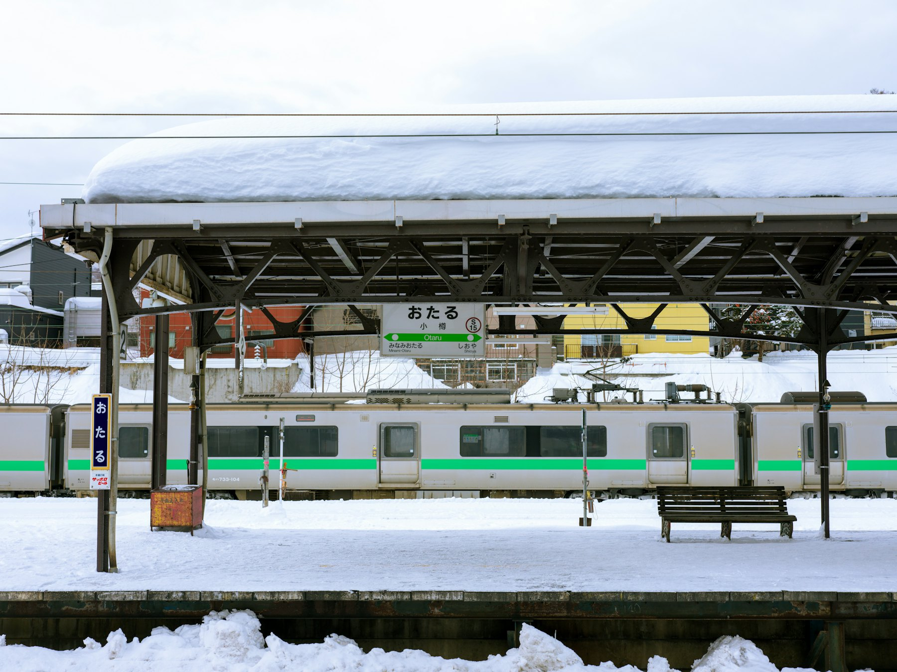

Hokkaido rewards slow travel. Distances are long, towns are far apart, and in winter the land between them becomes one enormous white field. The railway is the best way to watch it go by.

## Sapporo

Start in Sapporo, the island's capital, a city laid out on a grid and easy to walk. Eat ramen in the evening, visit the markets in the morning, and look into a regional rail pass if your route covers several long journeys. Check exactly what each pass includes before you buy.

## East through the interior

From Sapporo, trains run north-east through Asahikawa and over the mountains towards the Sea of Okhotsk. Some stretches have only a few services a day, so plan connections carefully and keep snacks in your bag. The reward is hours of forest, frozen rivers and small stations where you may be the only person getting off.

## Drift ice on the Okhotsk coast

In late winter, sea ice drifts down from the north and packs against Hokkaido's north-east coast. Seeing it from the shore, or from a sightseeing boat, is one of the strangest sights in Japan: a white, cracked plain where the sea should be.

## Shiretoko

The trip ends on the Shiretoko Peninsula, a protected wilderness where mountains run straight into the sea. In winter, much of it is only reachable on guided snowshoe walks. Book one. Walking through silent forest with a local guide, looking for fox tracks in fresh snow, is the best way to end a week of watching Hokkaido through a window.

## Practical notes

- Trains are punctual, but heavy snow can cause delays: build in a spare day.
- Coin lockers at larger stations make day trips easy.
- Smaller towns have limited English signage, so save station names in Japanese.
