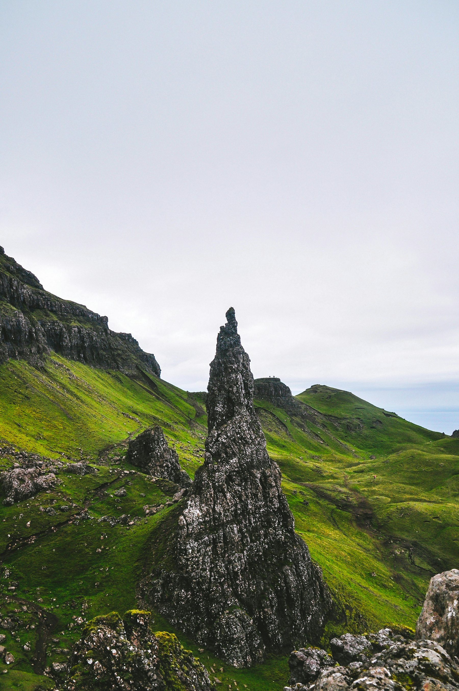

Everyone told me I'd need a car. The island is big, the buses are few, and the famous viewpoints sit at the end of single-track roads with passing places every few hundred metres. All true. But after three days relying on coaches, local buses and my own two feet, I came home convinced that the car is what most visitors to Skye should leave behind.

## Getting there

Long-distance coaches from Glasgow and Inverness cross the Skye Bridge and stop in Broadford and Portree. Book a window seat, then put your phone away. By the time you reach Portree you will have seen more mountain than most people manage in a day of driving, because nobody on that coach is watching the road.

## Base yourself in Portree

Portree is the island's main town and its bus hub. Stay two or three nights and do day trips from there. Rooms fill months ahead in summer, so book early, or come in May or late September, when the light is better anyway.

- **Day one:** the Trotternish loop by bus, getting off for the Old Man of Storr and walking up early, before the crowds.
- **Day two:** the coastal path north of town, then an afternoon in the harbour cafés waiting out the rain.
- **Day three:** the bus towards Staffin and the long walk along the Quiraing.

## What the timetable teaches you

With a car, Skye is a checklist. Without one, it is a series of waits: at a bus shelter in Staffin, on a bench outside a shop in Uig, at the edge of a sea loch while the tide comes in. Those waits are the trip. You talk to people. You notice the weather moving across the water. You stop treating the island as scenery.

> Skye without a car is not a compromise. It is the version of the island that people actually live in.

## Practical notes

Buses run less often on Sundays and in winter, so check the current timetable before planning a walk that ends at a bus stop. Carry waterproofs every day, whatever the morning looks like. And if you miss the last bus, ask in the nearest café: someone is usually heading your way.
