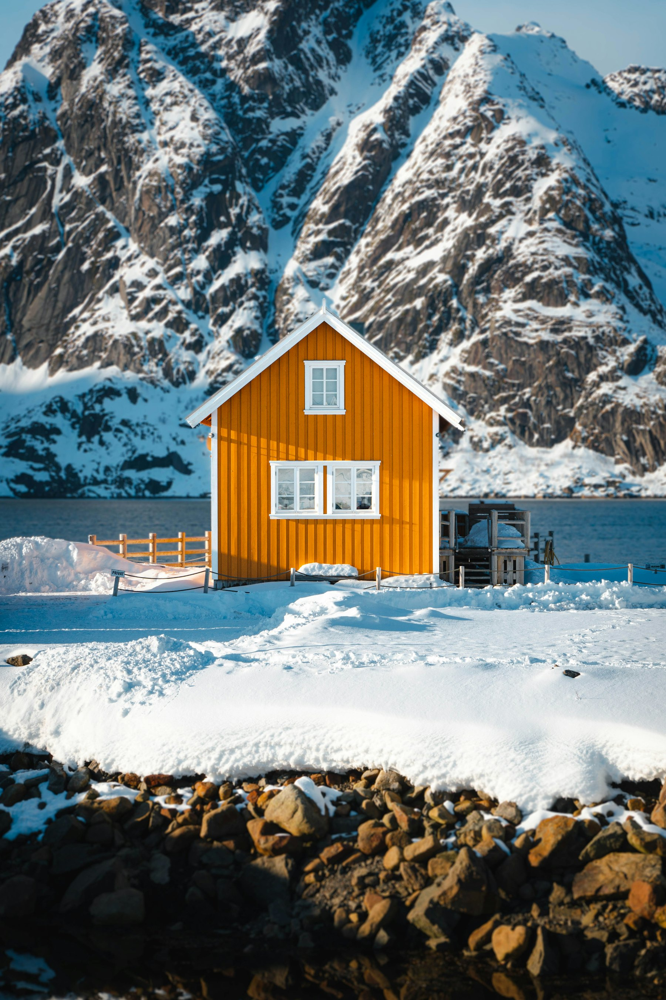

Most people visit Lofoten in summer, under the midnight sun. Winter is quieter, colder and, for many photographers, the whole reason to come. The light stays low all day, the mountains wear snow down to the waterline, and on clear nights the aurora can fill the sky.

## When to go

Late February and March are the sweet spot. The polar night is over, the days lengthen quickly, and the cod season fills the harbours with boats and drying racks. January is darker and less predictable.

## Getting around

The E10 road runs the length of the islands, linking the villages by bridges and tunnels. Driving it in winter is possible with proper tyres and patience, but conditions change fast. Local buses connect the main villages if you would rather not drive on ice.

## Where to stay

Book a *rorbu*, a traditional fisherman's cabin, in one of the villages towards the western end. Waking up with the sea under the floorboards is half the point. Many have small kitchens, which helps: restaurants keep short hours outside summer.

## What to pack

- Winter boots with good grip, or slip-on ice cleats
- Layers rather than one big coat: you warm up fast on any walk
- A head torch, even for short afternoon outings
- Spare batteries, kept in an inside pocket, because the cold drains them

## Chasing the aurora

Check the cloud forecast, not only the aurora activity index. A clear sky with modest activity beats a strong forecast behind cloud. Find a spot facing north, away from village lights, and give it an hour. If nothing happens, go inside, make tea, and look again at midnight.
