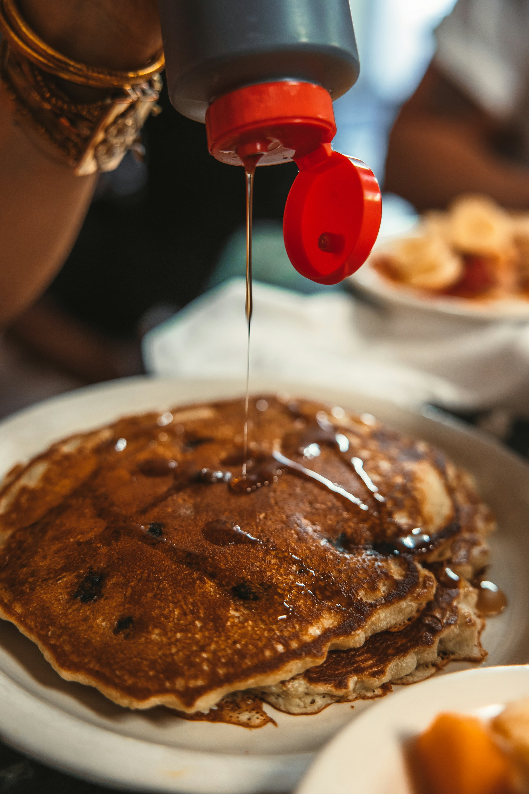

I grew up thinking breakfast was something you did quickly, standing up, before the real day began. Then I moved to Montréal, and a neighbour took me to the diner at the end of our street on a Saturday morning. We sat at the counter for two hours. Nobody hurried us. The cook asked my name on the first visit and remembered it on the second.

## The counter is the point

Tables are for groups. The counter is for regulars, for people on their own, for the man who reads the whole newspaper and the student revising over a coffee that never seems to empty. From there you watch the work: eggs cracked one-handed, toast buttered to the edges, orders called out and answered in a mix of French and English that nobody bothers to translate.

## A city of small rituals

Montréal eats out often and without ceremony. The diner is its most democratic room: builders, lawyers, grandmothers and hungover musicians all wait for the same booths. The menu rarely changes. The coffee is refilled before you think to ask.

> A good diner doesn't sell you breakfast. It sells you an hour where nothing is expected of you.

## What I took home

I still eat breakfast at a counter most Saturdays. I order the same thing every time, which my friends find boring and I find restful. I know the cooks by name. I tip well. And I've stopped thinking of breakfast as something to get through, and started treating it as the best seat in the city.
